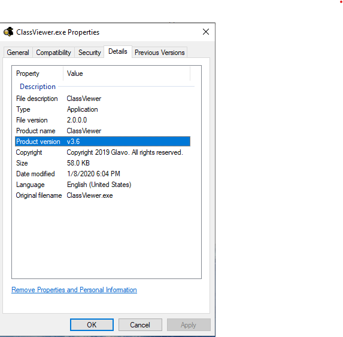
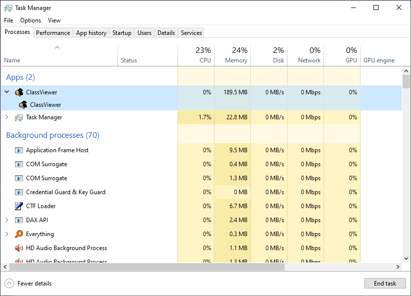

# Java GUI launcher

A lightweight Java GUI application launcher, you can easily customize the launcher icon, name, and file details properties.

The purpose of this project is to work with jre generated by [jlink](https://docs.oracle.com/en/java/javase/11/tools/jlink.html).
This launcher starts the JVM using the JNI invocation api, does not depend on java.exe / javaw.exe, you can exclude them when using jlink by adding the `--strip-native-commands` option.

Launching applications with this launcher can avoid opening a console, and the task manager shows the application name instead of the OpenJDK process name (i.e. *OpenJDK Platform binary*).





## Build your launcher 

Before building the launcher, please make sure that CMake is installed on your computer, 
and installed the necessary toolchains to build.

Build your launcher in the console (replace `<build-dir>` with where you want to build the launcher, 
replace `<sources-root>` with the source directory of the launcher, replace `<build-options>` with your [build options](#Build Options): 

```batch
cd <build-dir>
cmake <build-options> <sources-root>
cmake --build .
```

Example: 

```
cd java-gui-launcher
cmake -B build -DCMAKE_BUILD_TYPE=Release -DAPP_NAME=ClassViewer -DAPP_VERSION=v3 -DAPP_ICON=.\ClassViewer.ico -DAPP_ORG=org.glavo -DAPP_MAIN_CLASS=org.glavo.viewer.Main -DAPP_JRE_PATH=.\jre -DAPP_JVM_TYPE=server ..
cmake --build build
```

## Build Options

You can customize the generated launcher by passing build options.

|  Option  |  Description  |
| -------- | ------------ |
| -DAPP_NAME=\<application name\> |  application name |
| -DAPP_VERSION=[v]\<major\>[.\<minor\>[.\<patch\>[.\<tweak\>]]] | (Windows Only) application version number|
| -DAPP_ORG=\<organization name\> | (Windows Only)  company/organization name                                    |
| -DAPP_ICON=\<icon path\> | *(Optional, Windows Only)* application icon |
| -DAPP_JVM_TYPE=\<server\|client\> | JVM type. Default is `server` |
| -DAPP_MAIN_CLASS=\<main class name\> | full name of the main class, without the module name |
| -DAPP_JRE_PATH=\<jre path\> | JRE path. The path can be relative to the launcher, or it can be an absolute path. Default is `..` (put launcher into the `bin` directory of JRE) |
| -DAPP_COPYRIGHT=\<copyright notice\> | (Windows Only) application copyright notice |
| -DAPP_PREDEF_OPTIONS=\<predef vm options\> | predefined VM options, separate multiple options with `;;;`. See [JNI_CreateJavaVM](https://docs.oracle.com/en/java/javase/11/docs/specs/jni/invocation.html#jni_createjavavm), *Standard Options* table |

## Runtime Options
The launcher accepts arguments starting with `-J` and passes the rest of the content to JVM

Example: 
```
.\ClassViewer.exe -J-Xms128m -J-Xmx128m
```
